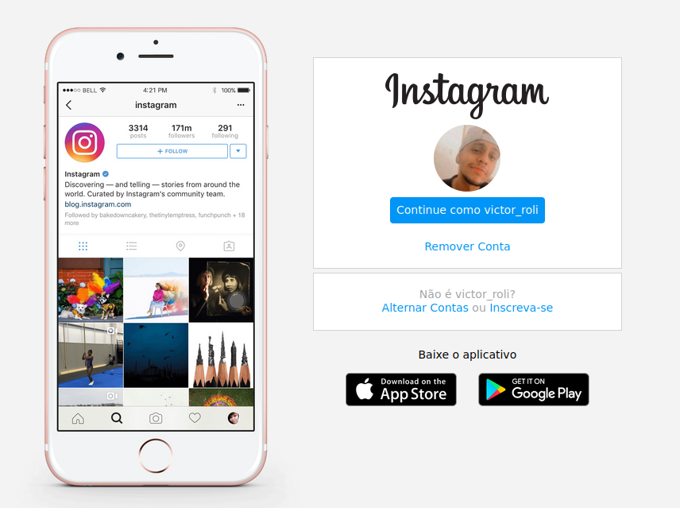

# Aula sobre Flexbox

Como exercício foi proposto a reconstrução da página de login do Instagram utilizando o flex-box. Segue abaixo os screenshots do resultado:

Exibição da tela para dispositivos móveis.

